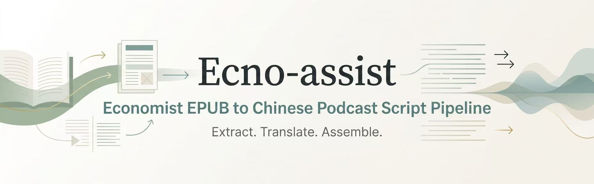
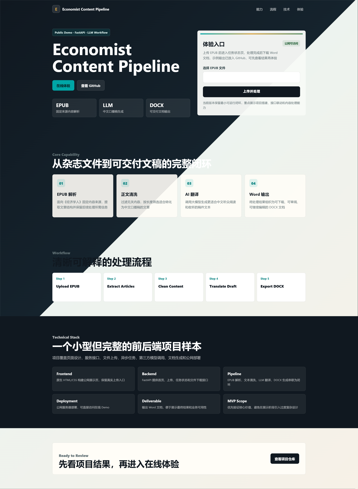

## 1. 项目概览 (Project Overview)

本项目是一个面向《经济学人》内容再加工场景的自动化生产管线。项目的核心目标不是做一个通用的 EPUB 阅读器，也不是简单地把英文文本直译为中文，而是围绕固定来源、固定输入格式和固定交付目标，快速完成从英文杂志内容到中文口播稿的转换闭环。

项目当前聚焦最小可运行版本。输入端接收 `.epub` 文件，处理输出 `.docx` 文件。整体链路可以概括为：

```text
EPUB 输入 → 文章提取 → 正文清洗 → 长度筛选 → 翻译处理 → Word 文档生成
```

该项目的实际价值在于减少内容生产中的重复劳动。对于需要长期阅读《经济学人》文章的个人，筛选合适篇章、阅读具体内容会消耗较多时间。通过自动化管线，这些步骤被压缩为一次文件输入和一次结果输出，使读者可以把精力集中在感兴趣的主题检索和快速阅读上。


## 2. 快速开始 (Quick Start)

### 在线使用

项目已部署到公网，可直接访问：

[立即打开 Economist Content Pipeline](http://8.133.178.210)

### 本地一键启动

Windows 用户在项目根目录双击或运行：

```powershell
start.bat
```

### 手动启动

如需手动启动服务，可运行：

```powershell
pip install -r requirements.txt
python -m uvicorn app:APP --app-dir src --host 127.0.0.1 --port 8000
```

### 命令行处理

```powershell
python src\pipeline.py 输入示例：TE20260509.epub
```


## 3. 真源表 (Source of Truth)

冲突时按下表裁决：

| 内容 | 唯一真源 |
| :--- | :--- |
| 主流程顺序 | `src/pipeline.py` |
| 输出文档生成 | `src/docx_builder.py` |
| EPUB 提取、正文筛选与文本清洗 | `src/article_processor.py` |
| 翻译调用与并发参数 | `src/translate_articles.py` |
| 服务接口、任务状态与下载行为 | `src/app.py` |
| 前端页面 | `frontend/index.html` |
| Python 依赖 | `requirements.txt` |
| 本地一键启动 | `start.bat` / `start.ps1` |
| 本地运行配置 | `.env` |
| 开发约束 | `AGENTS.md` |

## 4. 输出示意图


